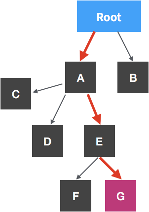
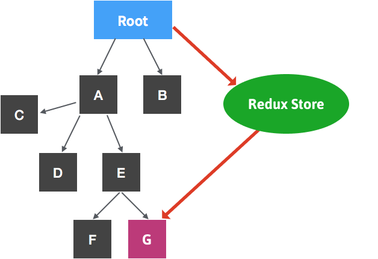
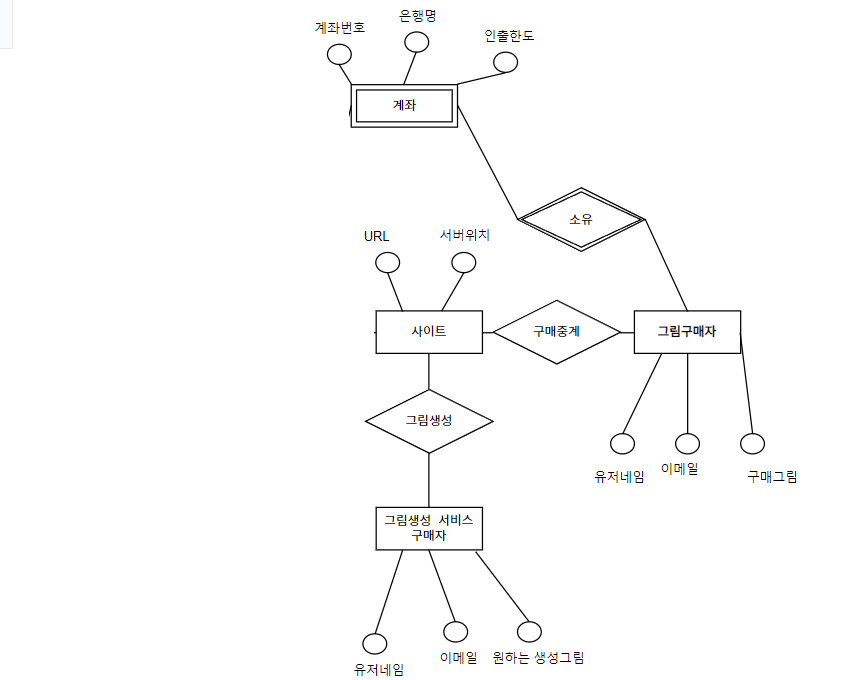
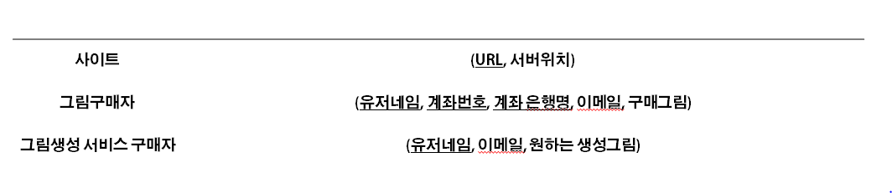
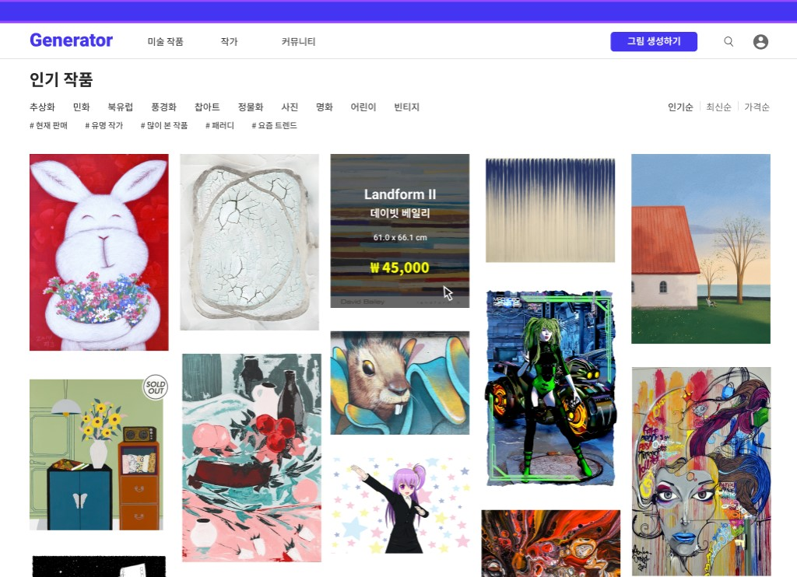
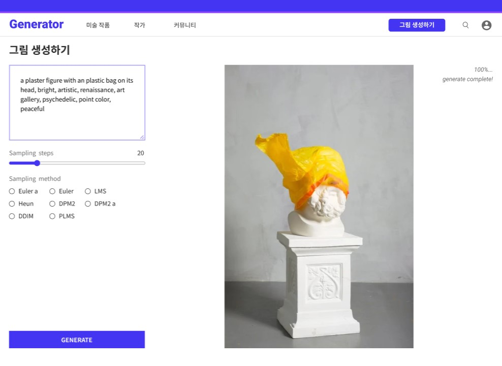
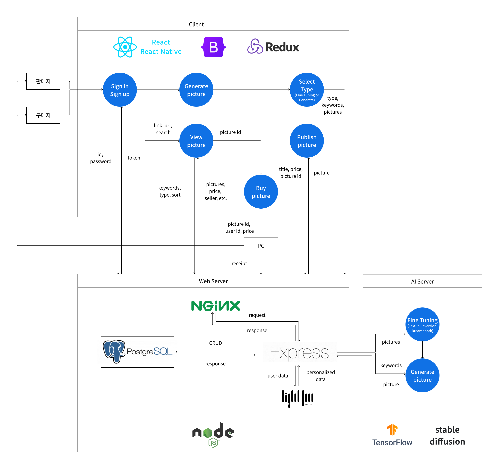

# 오픈소프트웨어(N) 1_14조 조별과제 report

## 목차

1. 추진배경
2. 기술 분석
3. 사용 오픈소스
4. 서비스 구현을 위한 설계
5. GUI 소개
6. API 정의
7. DFD
8. 소감

 

## 1. 추진배경

### 주제

    텍스트를 이미지로 전환시켜주는 Ai와 구매자를 연결시켜주는 웹 플랫폼 서비스

### 주제 추진 배경

텍스트 설명을 이미지로 변환시켜주는 Ai 이미지 생성기는 최근 몇 달 동안 웹을 휩쓸었다. 또한 최근에 메타와 구글은 텍스트 설명으로 비디오를 생성하는 Ai 비디오 생성기를 출시했다.

사용자가 입력한 텍스트를 이미지로 전환 시켜주는 ai의 성능은 사이버 펑크, 사이키델릭, 초현실적 스타일 등을 골라서 지정할 수도 있고, 심지어는 유명 화가들의 창작 스타일을 적용하여 다양하고 세상에 존재하지 않는 새로운 이미지들을 생성할 수 있다.

또한, 지난 8월 말 미국 “콜로라도 주립 박람회 미술대회”에서 1등을 차지한 그림이 Ai에 의해 만들어진 작품이라는 것이 알려지면서, Ai가 인간 고유의 활동이라 여겼던 창작의 영역까지 넘볼 수 있다는 사실이 확인 되었다. 정리하자면, 인공지능의 창작 결과물은 예술품으로 인정 받을 수 있다는 것을 의미한다.

이처럼 Ai의 발전에 따라, 사람들은 자신이 원하는 설명 텍스트를 입력하면 그 설명 텍스트에 맞게 고품질의 미술 작품을 생성해주는 Ai에 관심과 흥미를 갖고 있다.  
따라서 텍스트를 이미지로 전환시켜 주는 Ai 와 이 Ai 가 생성한 이미지들을 구매하고자 하는 사람들을 연결시켜주는 하나의 웹 플랫폼이 존재한다면 사람들은 간편하게 자신이 원하는 미술작품을 하나의 웹 플랫폼 상에서 구매할 수 있을 것이라 예상된다.

 

## 2. 기술분석

### 유사서비스 분석

#### \* 그림을 그려주는 AI 서비스들

-   미드 저니 (Midjourney)

    -   채팅 도구인 '디스코드(Discord)' 기반의 미드저니는 오픈AI(OpenAI)의 DALL-E나 구글(Google)의 Imagen과 같이 사용자가 제공한 프롬프트에 따라 이미지를 생성할 수 있다.

    -   원하는 컨셉의 그림을 단어로 입력하거나 사진을 업로드하면 AI가 현존하는 최고의 AI그림 퀄러티로 단지 몇초만에 그림을 그려준다. 이 사이트의 장점은 화풍을 자기가 원하는데로 설정할 수 있어 다양한 느낌의 그림을 사용자가 원하는대로 그릴 수 있다는 점이다.

-   노벨 AI (Novel AI)

    -   현재 가장 이슈되는 AI 그림 사이트로 다양한 애니메이션 그림을 그려주는 사이트이다.

    -   노벨 AI의 정식 명칭은 ‘노벨 AI 이미지 제너레이터’다. 원래는 소설을 써주는 딥러닝 AI이지만 개발자들이 그 기능을 이미지 생성 분야에 활용하는 방향으로 개발을 진행해 올해 10월 완성했다. 독일 뮌헨대와 하이델베르크대 연구진이 개발한 이미지 생성 AI인 ‘stable diffusion’을 기반으로 개발됐다.

-   AI portraits
    -   셀카를 업로드하여 AI가 그린 18세기 초상화를 그릴 수 있다. 무려 45000 종류의 고전 작품 속 인물에 대한 정보들이 입력되어 있기 때문에 다양한 사진들을 르네상스 느낌으로 표현할 수 있다. 최상의 결과를 얻으려면 여권과 같은 사진(얼굴 사진이 크고, 안경이 없는 사진)을 업로드하면 좋은 품질을 얻을 수 있다. 웹사이트보다는 어플로 이용하면 더욱 더 다양한 필터(만화, 인물 사진 HD, 할로윈 등)를 적용하여 그림을 그릴 수 있다.

 

## 3.사용 오픈소스

1.  React

    -   React

        -   사용자 인터페이스 구축을 위한 자바스크립트 라이브러리
        -   페이스북(메타)에서 개발한 프론트앤드 개발 오픈소스 자바스크립트 라이브러리로 SPA(Single Page Application)를 개발할 수 있다. 기존에 리액트를 비롯한 페이스북의 대부분의 오픈소스 프로젝트는 “BSD + Patents” 라이선스를 사용하였으나, 2017년 7월 Apache 재단이 “BSD + Patents” 라이선스를 사용하는 모든 코드를 금지하면서 결국 MIT 라이선스로 변경하였다.

    -   특징

        -   SPA 개발

            Single Page Application의 약자로 여러 개의 페이지로 구성된 전통적인 웹페이지와는 달리, 한 개의 페이지로 이루어진 애플리케이션이다. 사용자가 다른 페이지를 요청할 경우 전통적인 웹페이지에서는 서버에서 새로운 html을 받아 출력한다. 그러나 SPA에서는 페이지를 구성하는 모든 정보를 시작 시 한 번에 가져오고, 사용자가 다른 페이지를 요청하면 코드를 실행한다. 사용자 입장에서는 페이지 요청 시 딜레이(새로고침했을 때 빈 화면 같은)가 없다는 점이 가장 크게 체감될 것이다.

        -   컴포넌트 기반

            웹사이트에는 헤더, 내비게이션 등 재사용이 가능한 부분이 많이 보인다. 이것들을 컴포넌트라는 묶음으로 만들어 레고를 조립하듯 하나의 페이지에 뗐다 붙였다 할 수 있다. 예를 들어 메인 페이지에서는 헤더 컴포넌트와 메인 컴포넌트, 푸터 컴포넌트를 사용하도록 하고, 사용자가 검색 페이지를 클릭하면 메인 컴포넌트 대신 검색 컴포넌트로 바꿔주는 것이다.

        -   Virtual DOM

            DOM 이란 자바스크립트가 이용할 수 있도록 웹페이지 태그들을 트리구조로 만든 객체 모델이다. 전통적인 웹페이지에서는 특정 요소에 접근하여 10개의 변화를 주면 랜더 트리가 10번 수정되어 렌더링 된다. 그러나 리액트는 가상 돔을 사용하여 이전의 가상돔과 비교하고 바뀐 부분이 있는지 체크한다. 바뀐 부분이 있다면 그 부분만 실제 DOM에 적용하여 렌더링 횟수를 줄이게 된다.

    -   라이선스
        -   MIT라이선스

    

2.  React Native

    -   React Native

        -   리액트 네이티브는 페이스북에서 만든 오픈소스 모바일 애플리케이션 프레임워크이다.
            리액트 네이티브는 iOS와 안드로이드에서 동작하는 네이티브 모바일 앱을 만드는 자바스크립트 프레임 워크이다.
            Javascript로 개발이 가능하며 하나의 프로그래밍 언어로 IOS와 안드로이드 모바일 앱을 동시에 개발할 수 있는 크로스 플랫폼이다.

        즉, 웹 개발자가 익숙한 자바스크립트 라이브러리를 이용하면서 겉모습과 실제 동작까지 진짜 네이티브인 모바일 앱을 만들 수 있다.

        게다가 작성한 코드 대부분을 플랫폼 간에 공유할 수 있어서 리액트 네이티브를 이용하면 iOS와 안드로이드 앱을 동시에 개발할 수 있다는 장점이 존재하기 때문에 React Native를 사용하게 되었다.

    -   React Native의 장단점

        -   장점

            -   Objective-C 나 Java를 사용하지 않고 웹 개발자가 익숙한 기술 (리액트, 자바스크립트)을 이용하여 모바일 앱 개발을 할 수 있다.

            -   크로스 플랫폼 프레임워크 : 대부분의 코드가 플랫폼 간 공유가 가능해서 iOS와 안드로이드를 동시에 개발할 수 있다.

            -   비용 그리고 오픈 소스 : 하나의 언어 그리고 하나의 코드로 두 개의 OS 앱을 개발할 수 있기 때문에 일반적인 네이티브 앱을 개발하는 것보다 두배 비용이 저렴하게 든다. 또한 기존에 JavaScript 를 사용하는 개발자들이 많기 때문에 개발자들을 고용하는데도 좋고 쉽게 배울 수 있다.
                또한 앱의 유지보수에도 하나의 코드만 수정하면 되기에 유지 보수 비용도 줄어든다.
                리액트 네이티브는 오픈소스로 커뮤니티가 활성화되어 있고 많은 블로그에서 정보를 찾아볼 수 있다. 오픈 소스의 장점으로 문제 해결하는 데 참고 자료가 많이 있어 생산성을 증대시키고 비용을 절약할 수 있다.

        -   단점

            -   네이티브 보다 성능이 떨어진다. : 리액트 네이티브는 네이티브 브릿지를 사용, 자바스크립트 스레드와 네이티브 스레드를 연결시켜 동작하는 하이브리드 앱 방식이기 때문에 네티이브 개발 방식보다는 성능이 떨어진다.

            -   네이티브의 새로운 기능을 사용하는데 오래 걸린다. ( 안드로이드나 iOS에서 업데이트를 통해 새로 제공하는 API를 리액트 네이티브가 지원하기까지의 시간이 걸린다.)

            -   잦은 업데이트. 안정화가 되었지만 여전히 잦은 업데이트로 인해 잘 동작하던 기능이 갑자기 동작하지 않는 문제가 발생하는 경우가 있다.

    -   React native의 동작 방식

        -   React Native 앱은 크게 Native 부분과 JavaScript 부분으로 구성되어 있다.

        -   Native부분은 iOS에서는 Objective-C/Swift, Android에서는 Java/Kotlin이 담당하는 곳으로 UI를 렌더한다. UI스레드(메인 스레드)라 불리는 것이 UI를 생성한다.
        -   반면 JavaScript 부분에는 JS스레드가 있다.
            이곳은 말그대로 자바스크립트 엔진을 통해 자바스크립트 코드가 실행되는 곳이다. 비지니스 로직을 포함하여 뷰를 언제, 어떻게 표시할지와 같은 React관련 자바스크립트 코드가 실행되는 스레드이다.

    -   Native Bridge

        -   Native부분인 Main thread와 JavaScript부분인 JS thread는 Native Bridge라는 것을 통해 소통한다. 각 부분에서 전달되는 정보는 JSON object형태로 변환되어서 전달된다.

        -   결국은 React Native앱에서 가장 중요하다고 볼 수 있는 부분이 Native Bridge이다. 이 부분이 병목현상이 가장 많이 생기며 좋은 성능의 React Native앱을 위해서는 Native Bridge를 건너는 횟수를 최소한으로 해야한다.

    -   JS thread

        -   React Native어플리케이션을 실행하기 위해 webpack과 비슷하게 JavaScript코드들을 하나의 번들 파일로 만든다. 이후 JS스레드가 번들된 자바스크립트 코드를 실행하며 이벤트 루프가 끝날때마다 메인 스레드로 변경사항에 관한 정보를 전달한다. 다행히도 React의 효율적인 Diffing 알고리즘 덕분에 각 배치마다 UI의 최소한의 변경사항 정보만 Native Bridge를 건너게 할 수 있다.

    -   Diffing Algorithm

        -   React에서 우리가 선언적으로 정의하는 UI는 실제 DOM노드가 아니라 경량화된 자바스크립트 객체인 virtual DOM이다. React는 이 virtual DOM을 사용하여 최소한의 변경사항을 파악하여 새롭게 렌더하게 된다. 이때 사용하는 알고리즘이 diffing 알고리즘이다.

    -   Main Thread

        -   메인 스레드는 어플리케이션이 실행되자마자 시작된다. 앱을 로드하고 JS스레드를 실행시킨다. JS스레드의 매 이벤트 루프가 끝날때마다 Native Bridge를 통해 보내오는 메시지들을 받아 해석한 후 UI를 화면에 표시한다. 이 과정에서 shadow thread는 JS스레드로 부터 넘어오는 정보를 활용하여 화면의 layout을 계산한다. 웹에서의 reflow와 비슷하다. 또한 사용자들이 기기에 내리는 UI이벤트 명령들을 받고 Native Bridge를 경유해 JS스레드로 넘겨준다. 이때의 UI이벤트들은 press나 touch와 같은 이벤트이다.

    -   React Native 앱의 실행과정

        1. 앱이 시작되면서 메인 스레드가 실행되고 메인스레드는 JS 스레드를 실행시키고 자바스크립트 번들을 로드한다.
        2. JS 스레드가 실행되면서 React는 virtual DOM을 생성하고 diffing 알고리즘을 통해 변경사항을 Native Bridge를 경유하여 shadow 스레드로 전달한다.
        3. shadow 스레드는 변경사항 메세지를 통해 화면의 레이아웃을 계산하고 계산이 끝난 레이아웃의 파라미터나 객체를 메인 스레드로 보낸다.
        4. 메인스레드가 UI를 화면에 표시한다.
        5. 사용자가 화면에 입력한 UI 이벤트 정보들이 Native Bridge를 경유하여 JS 스레드로 보내진다.
        6. UI 이벤트 메세지를 활용하여 JS 스레드에서 비지니스 로직들이 실행되고 React는 다시 Virtual DOM을 생성하며 변경사항을 다시 Native Bridge를 경유하여 shadow thread로 전달된다.
        7. (3),(4),(5),(6) 과정이 반복된다.

    -   React Native의 라이선스
        -   Bootstrap과 마찬가지로 MIT 라이선스를 사용한다.

 

3.  Bootstrap

    -   Bootstrap

        -   부트스트랩은 반응형 웹페이지를 위한 무료 소프트웨어이며 HTML, CSS, JS 템플릿을 모아둔 프레임워크이다.
            부트스트랩은 각종 버튼, 테이블, 입력창 등 여러가지의 css style과 레이아웃 정렬을 class만으로 제어할 수 있다. 보통 여러명의 개발자가 각자 맡은 영역을 개발하기 때문에 완성물이 제각각인 경우가 생겨서 이를 통일 시키기 위해서 개발되었다.

        -   PC용 디자인 뿐만 아니라 태블릿 스마트폰 같은 모바일 디자인도 지원한다. 이 때문에 디자인할 시간이 크게 줄어들고 여러 웹 브라우저를 지원하기 위한 크로스 브라우징에 대해 신경 쓸 필요가 없다. 크로스 브라우징을 위한 각종 핵도 들어 있기 때문이다. 거기다 웹 브라우저 크기에 따라 자동으로 정렬되는 "그리드 시스템"을 채용하고 있기 때문에 웹페이지를 데스크탑, 태블릿, 스마트폰 모두에서 무리없이 보게 만들 수 있다. 즉 "반응형 웹 디자인"을 지원한다.  
            브라우저에 Bootstrap template 키워드로 검색하면 어마어마한 양의 템플릿이 존재하고, 무료로 제공하는 경우도 있으나 유로로 판매하는 경우도 많다.

        -   부트스트랩을 사용하면 코딩량을 줄여 개발 시간도 줄어들고, 디자인도 상당히 깔끔하게 사이트의 제작이 가능하다.  
            글자, 인용문, 목록, 표, 입력폼, 버튼, 이미지, 아이콘 등의 자잘한 것 뿐만 아니라 드롭다운 메뉴, 버튼, 탭, 리스트, 메뉴바, 페이지 이동 바 등의 웹 페이지에서 많이 쓰이는 요소를 거의 전부 내장하고 있고 개발자의 취향에 따라 재사용할 수 있기 때문에 Bootstrap을 사용하게 되었다.

    -   Bootstrap의 라이선스
        -   Bootstrap은 MIT 라이선스로 배포되며 2021 Twitter 가 저작권을 가지고 있다.
        -   필수
            -   작업물에서 Bootstrap의 CSS와 Javascript 내에 포함되어 있는 라이선스 및 저작권 고지를 유지
        -   허용
            -   Bootstrap을 자유롭게 다운로드하고 일부분 또는 전체를 개인적인 용도, 사적인 용도, 사내 용도, 상업적 목적으로 사용
            -   Bootstrap을 개발하는 패키지 또는 배포물에 사용
            -   소스 코드 수정
            -   라이선스에 포함되지 않은 제 3자에게 Bootstrap을 수정하고 배포할 수 있는 서브 라이선스를 부여
        -   금지
            -   Bootstrap은 보증 없이 제공되므로 작성자와 라이선스 소유자에게 손해에 대한 책임을 묻기
            -   Bootstrap의 제작자 또는 저작권 소유자에게 책임을 묻기
            -   적절한 저작권자 표시 없이 Bootstrap을 배포
            -   Twitter가 자신의 배포물을 승인한다고 명시 또는 암시할 수 있는 방법으로 Twitter가 소유하고 있는 상표를 사용
            -   문제가 있는 Twitter 소프트웨어를 만들었다고 명시 또는 암시할 수 있는 방법으로 Twitter가 소유한 상표를 사용

 

4.  Redux

    -   Redux

        -   상태관리를 위한 자바스크립트 라이브러리 이다.

    -   사용하는 이유

        -   Props Drilling 해결

            

            
            
            

            SPA는 기본적으로 여러 컴포넌트를 만들고 이를 조합하는 구조이다. 예를 들어 헤더, 메인, 검색창 등을 각각의 컴포넌트로 만들고 필요할 때 불러오는 방식이다. 위의 사진에서 만약 Root에서 G 컴포넌트까지 정보를 보내고 싶다면 A 컴포넌트와 E 컴포넌트를 거쳐야 된다. 지금은 4레벨의 트리구조지만 만약 더 작은 단위까지 컴포넌트를 쪼갠다면 거쳐야 될 컴포넌트가 많아질 것이고, 유지 보수에 어려움이 생긴다. Redux를 사용하면 상태 값을 컴포넌트에 종속시키지 않고, 밖에서 관리할 수 있다.

    -   라이선스
        -   MIT 라이선스

 

6. NGINX

    - NGINX

        Nginx(엔진엑스)는 igor Sysoev라는 러시아 개발자가 개발한 동시접속 처리에 특화된 웹 서버 프로그램이다.
        Apache보다 동작이 단순하고, 전달자 역할만 하기 때문에 동시접속 처리에 특화되어 있다.
        즉 경량 웹 서버이다.
        HTTP Web Sever로 활용되기도 하고, Reverse Proxy Sever 로 활용하여 WAS서버의 부하를 줄일 수 있는 로드 밸러서로 활용되기도 한다.

    - Nginx(웹서버)의 역할

        - 정적 파일을 처리하는 HTTP 서버로서의 역할 (HTTP 프로토콜을 준수)
          웹서버의 역할은 HTML, CSS, Javascript, 이미지와 같은 정보를 웹 브라우저(Chrome, lexplore, Opera, Firefox)에 전송하는 역할을 한다.

        - 응용프로그램 서버에 요청을 보내는 리버스 프록시로서의 역할
          두 번째 역할은 리버스 프록시(reverse proxy)인데, 즉 클라이언트는 가짜 서버에 요청(request)하면, 프록시 서버가 배후 서버(reverse server)로부터 데이터를 가져오는 역할을 한다. 여기서 프록시 서버가 Nginx, 배후서버가 응용프로그램 서버를 의미한다.
          웹 응용프로그램 서버에 리버스 프록시(Nginx)를 두는 이유는 요청(request)에 대한 버퍼링이 있기 때문이다. 클라이언트가 직접 App 서버에 직접 요청하는 경우, 프로세스 1개가 응답 대기 상태가 되어야만 한다. 따라서 프록시 서버를 둠으로써 요청을 배분하는 역할을 한다.

    - Nginx의 구조

        - Nginx는 하나의 Master process와 다수의 Worker Process로 구성되어 실행이 된다. Master Process는 설정 파일을 읽고, 유효성을 검사하고 Worker Process를 관리한다.
          모든 요청은 Worker Process에서 처리한다.
          Nginx는 이벤트 기반 모델을 사용하고, Worker Process의 개수는 설정 파일에서 정의되며, 정의된 프로세스 개수와 사용 가능한 CPU 코어 숫자에 맞게 자동으로 조정이 된다.

    - Nginx 라이선스
        - NGINX의 라이선스는 BSD 2-Clause 라이선스를 사용하는데, "Simplified BSD 라이선스" 또는 "FreeBSD 라이선스"라고 부르기도 한다. -즉, 원저작자를 밝히고 원래 라이선스를 그대로 유지하는 조건만 갖추면, 자유롭게 수정 및 재배포가 가능하다. 다시말해, 수정된 소스를 공개하거나 소스코드를 제공해야 할 의무도 없는 자유로운 라이선스이다.

 

7.  Express.js

    

    -   Express.js

        -   Express.js는 Node.js를 위한 빠르고 개방적이고 간결한 웹 프레임워크로, Python의 Django, Java의 Spring 프레임워크처럼 javascript에서 사용하는 웹 프레임워크의 종류 중 하나이다.

    -   Express.js의 장점

        -   익스프레스는 가볍고 유연하게 웹 프레임웍을 구성할 수 있는 장점이 있다. 이것은 미들웨어(Middleware) 구조
            때문에 가능한 것이고 자바스크립트 코드로 작성된 다양한 기능의 미들웨어는 개발자가 필요한 것만 선택하여 익스프레스와 결합해 사용할 수 있게 한다.
        -   Express 프레임워크는 코드의 양을 줄여주고 추후에 유지보수를 쉽게 하도록 만든다. (npm에서 간단하게 설치 가능하며, 이를 통합한 서버 프로그램을 만들 수 있음)
            또한 Node.js에서 많이 이용하는 템플릿 엔진인 EJS를 이용할 수 있기 때문에, 지금까지 만든 EJS 템플릿을 그대로 재사용할 수 있다는 장점도 가지고 있다.

    -   Express 라우팅

        -   클라이언트의 요청을 위한 URL 스키마를 라우트라고 한다. GET /을 예로 들면 클라이언트가 GET 메소를 이용해 / URI에 해당하는 서버자원을 요청한다는 의미로 해석한다.
            만약 POST 메소드를 사용한다면 서버에 자원을 생성하는 요청이다. 이렇게 URL 스키마는 서버와 클라이언트간의 통신 인터페이스를 제공해 주는 역할을 한다.

    -   Express 코드
        -   기존의 데이터 기반 웹사이트에서 웹 애플리케이션은 웹 브라우저(또는 다른 클라이언트)의 HTTP 요청을 기다린다.
            POST요청이 수신되면 애플리케이션은 URL 패턴과 데이터 또는 데이터 에 포함된 관련 정보를 기반으로 어떤 조치가 필요한지 알아낸다. GET요청은 필요한 항목에 따라 데이터베이스에서 정보를 읽거나 쓰거나 요청을 충족시키는 데 필요한 다른 작업을 수행할 수 있다.
            그런 다음 애플리케이션은 웹 브라우저에 응답을 반환하며, 검색된 데이터를 HTML 템플릿의 자리 표시자에 삽입하여 브라우저가 표시할 HTML 페이지를 동적으로 생성하는 경우가 많다.
            Express는 특정 HTTP 동사( GET, POST, SET등) 및 URL 패턴("경로")에 대해 호출되는 함수를 지정하는 메서드와 템플릿 파일이 있는 위치에서 사용되는 템플릿("보기")
            엔진을 지정하는 메서드를 제공한다. 응답을 렌더링하는 데 사용할 템플릿. Express 미들웨어를 사용하여 쿠키, 세션 및 사용자, 가져오기 POST/ GET매개변수 등에 대한 지원을 추가할 수 있다.
            Node에서 지원하는 모든 데이터베이스 메커니즘을 사용할 수 있다(Express는 데이터베이스 관련 동작을 정의하지 않음).
    -   라이선스
        -   MIT라이선스

 

8. PostgreSQL

    - PostgreSQL
        - PostgreSQL은 객체 관계형 데이터베이스 관리 시스템(ORDBMS)중 하나이다.
        - BSD 라이선스였으나 MIT 라이선스와 비슷한 독자적 라이선스를 따르기 시작했다.
        - 오픈소스 개발자 및 오라클 개발자들이 개발에 합류하여 oracle과 유사한 부분이 많다.
        - 소규모 애플리케이션에서부터 동시 접속 사용자가 많은 대형 애플리케이션까지 다방면으로 관리할 수 있다.
        - Linux, Unix, Mac OS X, Microsoft Windows를 포함한 거의 모든 운영 체제에서 이용이 가능하다.
    - PostgreSQL 장단점

        - 장점

            - BSD 라이선스를 기반으로 개발되어 라이선스에 대한 비용 문제가 없으며 소스코드를 변경한 후 공개하지 않고 재배포해도 법적으로 문제가 없다.
            - 표준 SQL을 따르며 대용량 처리를 문제없이 수행하고 오래된 오픈소스인만큼 안정적이다.
            - Perl, Python, Java와 같은 다른 임베디드 언어로 확장될 수 있다.
            - PostgreSQL만의 독창적인 자료형을 갖고 있으며 jsonb, json 형식으로 저장이 가능하다.
            - ILIKE기능으로 대소문자에 상관없이 매칭되는 글자를 찾을 수 있다.

        - 단점
            - CRUD 성능이 관계형 데이터베이스 관리 시스템(RDBMS)보다 떨어진다.
            - 독창적인 문법과 자료형 때문에 새로운 개발자를 가르치는데 많은 비용이 발생하고 다른 DB로의 이동이 어렵다.
            - UPDATE 쿼리가 약해 UPDATE 수행시 불안정한 문제를 가지고 있어 이를 반복적으로 수행해야하는 응용서비스에 제약이 있다.
            - 새로운 클라이언트 연결이 매번 새로운 프로세스 형식으로 실행되는데 한 프로세스당 약 10MB의 메모리가 할당되며 연결이 많아질수록 메모리가 빠르게 증가하여 메모리 성능이 떨어진다.

        @CRUD: 컴퓨터 소프트웨어가 가지는 기본적인 데이터 처리 기능인 Create(생성), Read(읽기), Update(갱신), Delete(삭제)를 묶어서 일컫는 말.

    - PostgrSQL 라이선스
        - PostgreSQL은 PostgreSQL Licence를 따르는데 이것은 PostgreSQL과 함께 배포되는 라이선스로 BSD, MIT 라이선스와 유사하고 매우 자유로운 라이선스이다
        - BSD, MIT 라이선스와 유사하여 소스를 수정해서 새로운 상용 데이터베이스를 만든다 하더라도 소스를 공개할 의무가 없다.
        - 소프트웨어의 사용, 복제, 변경, 배포가 허용되며 무료이고 서면에 의한 동의도 요구하지 않는다.

9. Stable Diffusion

    - Stable diffusion

        - Stability AI에서 학습시킨 stable diffusion은 첫 번째 인공지능 모델이다. DALLE2나 구글의 Imagen과 비슷한 품질을 보여주는 Text to Image AI 엔진인데 기존에 나왔던 다른 오픈소스들과 달리 품질이 향상되었다.

    - Stable diffusion의 구조

        - Stable diffusion은 데이터 세트에서 학습한 내용을 일단 노이즈로 돌리고, 주어진 프롬프트나 이미지에 의해 방향을 지정하면서 노이즈 제거를 실시하여 이미지를 생성하는 구조이다.

    - Stable diffusion의 장단점

        - 장점

            - Stable Diffusion의 기본은 초해상 기술입니다. 예를 들어 저해상도의 화상을 단순히 확대했을 때, 사이즈가 커져도 해상도는 그대로이므로, 노이즈가 눈에 띄게 된다. 그래서 기계학습 알고리즘에의해 노이즈를 제거해 해상도를 올린다.

            - OpenAI의 DALLE2처럼 방대한 데이터셋과 방대한 연산 자원(GPU)이 없는 개인도 사용할 수 있습니다. 즉 컴퓨팅 사용리소스를 대폭 줄여 4GB이하의 VRAM을 가진 컴퓨터에서도 돌릴수도 있다.

        - 단점
            - OpenAI에서 stable diffusion을 학습시켰을 때 불법사이트를 이용해 그림작가들의 작품을 무단으로 학습시켰다. 그로 인해서 현재 저작권 문제가 화두가 되고 있다. 법적으로는 AI의 저작권 문제에 대한 제도적으로 없어서 stable diffusion모델을 사용해도 되지만 시간이 좀 더 지나고 제도에 따라 stable diffusion을 사용할 수도 없을 수도 있다.

    - 라이선스
        - Stable AI에서 오픈소스 머신러닝 전용 라이선스를 새로 만들었다.
          일반적인 오픈소스 라이선스와 다르게 Stable Diffusion을 사용하여 서비스를 할 경우 반드시 명시를 하여야 하고 파인 튜닝을 모델들은 라이선스에 명시된 특정 제한적인 용도에는 사용이 되면 안된다.
        - stable diffusion을 생성된 이미지에 대한 권리를 주장하지 않으며 이미지 콘텐츠가 불법이거나 개인에게 유해하지 않은 경우 모델에서 생성된 이미지에 대한 사용 권한을 사용자에게 자유롭게 부여한다.
        - 상업적으로 이용가능 하다. Stanble diffusion 소스 코드는 소스코드에서 광범위하게 빌드되는 상업적 재구현 및 파생 작업을 금지하지 않는 매우 허용적인 라이선스에 따라 배포되었다.
        - 이미지 판매가능 하다. Stable diffusion 또는 DALLE와 같은 시스템으로 이미지를 생성하는 사람은 누구나 이미지를 판매가 가능하다.

 

10. TensorFlow

    -   TensorFlow

        -   TensorFlow는 구글이 2015년에 오픈 소스로 공개한 기계학습 라이브러리다. 딥러닝과 기계학습을 일반인도 이해하기 쉽도록 다양한 기능을 제공하는 것이 특징이며 알파고 이후 대중적인 인식이 생겼다.
        -   Python을 활용한 연산처리가 가능하며 언어 중에서도 Python 관련 자료가 가장 많다.

    -   특징

        -   데이터 플로우 그래프를 통한 풍부한 표현력
        -   노드와 엣지를 통한 데이터 흐름을 연산힌 결과 값을 도출 가능
        -   아이디어 테스트에서 서비스 단계까지 이용 가능
        -   텐서플로우 하나로 처음부터 끝까지의 다양한 작업이 가능
        -   계산 구조, 목표 함수 정의시 자동으로 미분 계산
        -   텐서플로우의 미분 방식을 통해 심층 신경망을 학습시키고 실행할 수 있다.

    -   다양한 언어 지원

        -   Python, C++, Go, Java, R을 지원하며 SWIG를 통한 언어 지원이 가능하다.

    -   TensorFlow의 역할
        -   다양한 AI 모델을 지원할 수 있는 기능으로 스테이블 디퓨전을 보조해 더욱 정확하고 완성도 높은 AI 일러스트를 제공 가능하다. 또한 다양한 인터페이스와 연결 가능한 텐서플로우를 활용해 제공된 자료와 결과물을 다양한 방식으로 응용 가능하다.
    -   라이선스

        -   Apache 2.0 라이선스를 사용한다. 아파치 재단이나 재단의 프로젝트에 의해서 만들어진 모든 소프트웨어는 현재 Apache License 2.0에 의해 배포되고 있다.

    -   배포시 의무사항

        -   수취인에게 라이선스 사본 제공
        -   수정된 파일에 대해 수정사항을 표시한 안내문구 첨부
        -   저작권, 특허, 상표, attribution에 대한 고지사항을 소스코드 또는 "NOTICE" 파일 등에 포함
        -   최초개발자 등을 위해 보증을 면제하고, 책임을 제한

    -   허용
        -   자유로운 소스코드의 복제, 배포, 수정
        -   명시적 특허 라이선스의 허용
        -   조합저작물(Lager Work) 작성 및 타 라이선스로의 배포 허용
        -   상업적 이용 허용
        -   소스코드 공개의무 X

 

11. Lightfm

    -   LightFM

        -   많은 신규 고객과 잦은 상품 등록(cold-start)에 대응할 수 있도록 Content-based와 Collaborative Filtering의 장점을 결합한 Hybrid형 모델이다.

        -   LightFM은 학습 데이터에서 Collaborative 데이터와 User/Item Feature를 모두 사용하고, LightFM에서 생성된 Embedding 벡터는 feature에 대한 중요한 의미 정보를 포함하고 있고, 이는 tag 추천과 같은 일에서 중요하게 사용될 수 있다는 특징을 가지고 있다.

        -   LightFM은 BPR(Bayesian Personilsed Ranking), WARP(Weighted Approcimate-Rank Pairwise)와 같은 랭킹 손실 함수를 기반으로 데이터를 학습하며, 고객이 상품에 행동(구매, 평점 등)을 취할 확률을 예측하여 높은 확률의 상품을 고객에게 추천하는 방식이다.

        -   LightFM은 cold-start에 대응 가능하다는 장점과 모델의 평가 지표로 AUC 평가 함수가 패키지로 제공되는 장점 때문에 LightFM을 선정하게 되었다.

        -   본 모델에서 LightFM은 학습된 고객 데이터, 상품 데이터, 고객이 이전에 구매한 상품에 대한 평가 데이터를 WARP 랭킹 손실 함수로 학습하고, 고객 ID를 기준으로 Predict 함수를 사용하여 추천 데이터를 NumPy 배열 형태로 반환한다.

    -   LightFM의 라이선스

        -   Apache 2.0 라이선스를 사용한다. 아파치 재단이나 재단의 프로젝트에 의해서 만들어진 모든 소프트웨어는 현재 Apache License 2.0에 의해 배포되고 있다.

    -   배포시 의무사항

        -   수취인에게 라이선스 사본 제공
        -   수정된 파일에 대해 수정사항을 표시한 안내문구 첨부
        -   저작권, 특허, 상표, attribution에 대한 고지사항을 소스코드 또는 "NOTICE" 파일 등에 포함
        -   최초개발자 등을 위해 보증을 면제하고, 책임을 제한

    -   허용
        -   자유로운 소스코드의 복제, 배포, 수정
        -   명시적 특허 라이선스의 허용
        -   조합저작물(Lager Work) 작성 및 타 라이선스로의 배포 허용
        -   상업적 이용 허용
        -   소스코드 공개의무 X

 

12. Pandas

    -   Pandas

        -   Pandas는 수치형 테이블과 시계열 데이터를 조작하고 운영하기 위한 데이터를 제공하는데, 3조항 BSD 라이선스 조건 하에서 무료로 사용 가능하다.

        -   Pandas의 이름은 계량 경제학에서 사용되는 용어인 'PANel DAta'의 앞 글자를 따서 지어졌다. 당연히 실제 동물인 판다와는 아무런 관련이 없지만, 이름이 이름이니만큼 각종 개발 관련 사이트에서 판다 이미지를 활용하여 Pandas를 소개하곤 한다.

        -   데이터 조작 및 분석을 위한 Python 프로그래밍 언어 용으로 작성된 소프트웨어 라이브러리이다.

        -   Pandas는 주로 데이터 분석에 사용된다. Pandas를 사용하면 쉼표로 구분된 값 , JSON , SQL 및 Microsoft Excel 과 같은 다양한 파일 형식에서 데이터를 가져올 수 있다.

        -   데이터의 병합 등의 각종 데이터 처리 동작을 허용, 재편, 선택 뿐만 아니라 청소 데이터 및 데이터 승강이 가능하다.
        -   본 모델에서는 LightFM이 반환한 NumPy 배열을 DataFrame으로 변환하여 최종적으로 추천된 상품을 반환하는 데에 사용된다. Pandas는 Numpy의 대부분의 기능을 수행할 수 있고, Numpy보다 용이한 접근성을 가지고 있기 때문에 선정하게 되었다.

    -   Pandas의 세부 기능

        -   Python 자료구조와의 호환(List, Tuple, Dict, NumPyArray 등)
        -   큰 데이터의 빠른 Indexing, Slicing, Sorting
        -   두 데이터 간의 Join(행, 열 방향) 기능
        -   데이터의 티봇팅 및 그룹핑
        -   데이터의 통계 및 시각화 기능
        -   외부 데이터를 입력받아 Pandas 자료구조로 저장 및 출력(CSV, 구분자가 있는 txt, 엑셀데이터, SQL Database, XML 등)

    -   라이선스
        -   3조항 BSD라이선스 조건하에 New BSD 라이센스를 사용한다.

 

13. scikit-learn

    -   scikit-learn

        -   cikit-learn이란 python을 대표하는 머신러닝 라이브러리이다. '사이킷런'이라고 부르기도 한다.

        -   scikit-learn은 오픈 소스로 공개되어 있으며, 개인, 비즈니스 관계없이 누구나 무료로 사용가능하다. scikit-learn은 현재도 활용하여 개발이 이루어지고 있으며, 인터넷 상에서 정보를 찾기에도 쉽다.

        -   많은 머신러닝 알고리즘이 구현되어 있는데, 어떤 알고리즘도 같은 방식으로 이용이 가능하다. 또, 샘플 데이터 셋(토이 데이터 셋)이 부속되어 있으므로, 설치하여 바로 기계 학습을 시험해볼 수 있다.

        -   그러므로 초심자가 기계학습을 배우기 시작할 때 적합한 라이브러리라고 말한다. 다양한 분류, 회귀, 그리고 서포트 벡터 머신, 랜덤 포레스트, 그라디언트 부스팅, k-평균 , DBSCAN을 포함한 클러스터링 알고리즘을 특징으로 한다.

        -   본 모델에서 학습에 사용되는 데이터를 전달받아 벡터 값으로 변환하여 LightFM이 정상적으로 데이터를 학습할 수 있도록 한다. scikit-learn은 라이브러리 외적으로는 scikit 스택을 사용하고 있기 때문에 다른 라이브러리와의 호환성이 좋고, 내적으로는 통일된 인터페이스를 가지고 있기 때문에 매우 간단하게 여러 기법을 적용할 수 있어 쉽고 빠르게 최상의 결과를 얻을 수 있다는 장점이 있기 때문에 선정하게 되었다.

    -   scikit-learn의 세부 기능

        -   분류（classification ) - 주어진 데이터가 어느 클래스에 속하는 판별하는 것이다.

            1. SGD（stochastic gradient descent)

                - 대규모 데이터(10만건 이상)의 경우 추천한다. 선형의 클래스 분류 방법이다.

            2. 커넬근사

                - SGD로 잘 분류할 수 없는 경우에 이용하며, 비선형적인 클래스 분류방법이다. 이것도 대규모 데이터에 적합하다.

            3. Linear SVC

                - 중소규모(10만건 미만)의 경우 추천하며, 선형의 클래스 분류 방법이다.

            4. k근접법

                - Linear SVC로 잘 분류되지 않는 경우 사용하며, 비선형적인 클래스 분류 방법이다. 이것은 중소 규모의 데이터 분류에 추천한다.

        -   회귀（regression）- 전달된 데이터를 바탕으로 값을 예상한다.

            1. SGD（stochastic gradient descent）

                - 대규모 데이터(10만건 이상)의 경우 추천하는 선형 회귀 분석 방법이다.

            2. LASSO、ElasticNet

                - 중소규모(10만건 미만)으로 설명 변수의 일부가 중요한 경우에 추천하는 회귀 분석 방법이다.

            3. Ridge、Liner SVR

                - 중소규모(10만건 미만)으로 설명 변수의 전부가 중요한 경우에 추천하는 회귀 분석 방법이다.

            4. SVR（가우스 커넬）、Ensemble

                - Ridge또는 Liner SVR로 잘 분석되지 않는 경우 이용하며, 비선형적 회귀 분석 방법이다.

        -   클러스터링（clustering) - 전달된 데이터를 어떤 규칙에 따라 나누는 것이다.

            1. KMeans

                - 몇 개의 클러스터를 분할할지, 사전에 정해둔 경우 추천하는 클러스터링분석방법이다.

                - 대규모 데이터의 경우, MiniBatch라고 해서 데이터를 나누면서 학습시키는 방법을 취한다.

            2. 스펙트럼 클러스터링(GMM)

                - KMeans로 잘 분석되지 않는 경우에 이용하며, 비선형적인 클러스터링 분석 방법이다.

            3. MeanShift、VBGMM

                - 몇 개의 클러스터로 나눌지에 대해, 사전에 정할 수 없는 경우에 추천하는 클러스터링 분석 방법이다.

        -   그 외 기타 기능

            1. 차원감소

                - 전달된 데이터의 차원 수가 많은 경우, 학습효율이 떨어지므로 차원을 감소시키는 전처리를 실시한다.

                - PCA、커넬PCA、Isomap、SpectralEmbedding등의 방법이 있다.

            2. 하이퍼 파라미터의 최적화

                - 기계학습을 실행할 때, 학습 방법 등을 조정하는 수치를 하이퍼 파라미터라고 한다.

                - 그리드 서치, 크로스밸리테이션 등의 방법이 있다.

    -   라이선스

        -   Pandas와 마찬가지로 New BSD라이선스를 사용한다. 3-Clause BSD License(BSD-3-Clause) 와 같은 의미이다. 2-Clause BSD License를 기반으로 한다.

    -   배포시 의무사항

        -   재배포시 저작권 표시, 준수 조건 및 보증부인에 대한 고지사항을 소스코드 또는 문서 및 기타 자료에 포함

        -   최초개발자나 기여자의 이름을 제품에 대한 보증이나 홍보에 사용하지 못함
        -   BSD 라이선스가 걸린 소프트웨어로 인하여 법률상/도의상 피해가 발생하더라도, 그 책임을 저작권자에게 물을 수 없다.

    -   허용

        -   누구나 복제, 수정, 배포 가능
        -   소스코드 공개의무 X
        -   조합저작물(Lager Work) 작성 및 타 라이선스 배포 가능(조건부)
        -   상업적 이용 가능

 

## 4. 서비스 구현을 위한 설계

-   ER 다이어그램

      

-   DB 스키마

      

 

## 5. GUI 소개

-   메인화면
    

-   그림 생성 화면
    

 

## 6. API 정의

| Description         | Method | URI                   | Request Header / Body                                 |
| ------------------- | ------ | --------------------- | ----------------------------------------------------- |
| 회원 등록           | POST   | /user/{userId}        | name (String), id (String), password (String)   |
| 회원 정보 조회      | GET    | /user/{userId}        | auth_token (String)                                   |
| 회원 정보 수정      | PUT    | /user/{userId}        | auth_token (String)                                   |
| 회원 탈퇴           | DELETE | /user/{userId}        | auth_token (String)                                   |
| 로그인              | POST   | /session              | id (String), password (String)                     |
| 로그아웃            | DELETE | /session              | auth_token (String)                                   |
| 모든 그림 조회      | GET    | /pictures             |                                                       |
| 그림 생성           | POST   | /pictures             | auth_token (String), keyword(String)               |
| 모델 파인 튜닝      | POST   | /tunning              | auth_token (String), keyword(String)   pictures |
| 특정 그림 정보 조회 | GET    | /pictures/{pictureId} |                                                       |
| 특정 그림 정보 수정 | PUT    | /pictures/{pictureId} | auth_token (String)                                   |
| 특정 그림 삭제      | DELETE | /pictures/{pictureId} | auth_token (String)                                   |

 

## 7. DFD

 

## 8. 소감

-   정재훈: 좋은 조원분들과 같이 과제 할 수 있어서 좋았고 부족한 부분을 배울 수 있어서 뜻 깊은 경험이였다.
-   곽범석: 이번 프로젝트를 통해 서비스 기획과 설계의 관점에서 고민을 하며, 코더가 아닌 개발자에 한걸음 가까워진 것 같습니다. 또한 오픈소스라는 집단지성의 결과물과 팀원들과의 협업이 좋은 시너지를 내어 만족스럽습니다.
