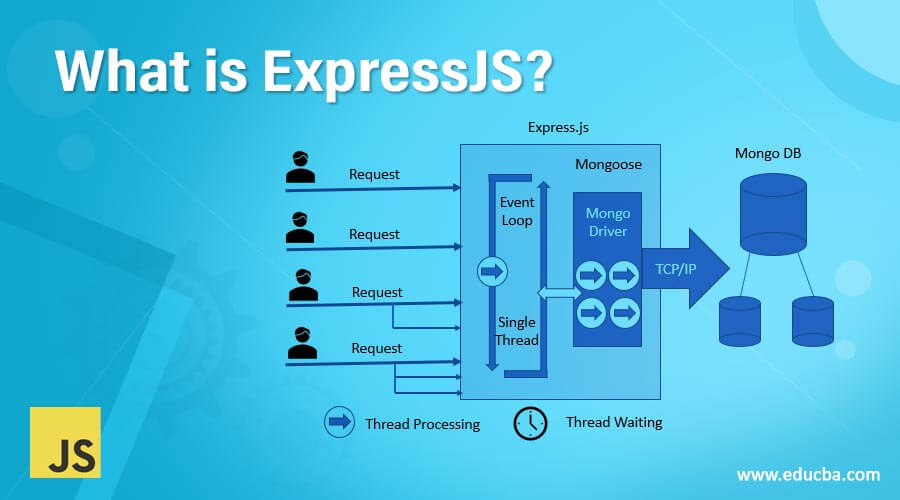

오픈소프트웨어(N) 1_14조 조별과제 report
======
목차
------
1. 추진배경-임하늘, 강다현
2. 기술 분석-임하늘, 강다현
3. 유사서비스 분석- 임하늘, 강다현
4. 사용 오픈소스(설명, 선정이유, 상세분석, 활용계획)- 전원
5. 서비스 구현을 위한 설계-정재훈
6. GUI 소개- 곽범석, 전세정
7. API 정의-곽범석, 국승빈, 권화경, 정세영
8. DFD-곽범석, 국승빈, 권화경, 정세영
9. 마무리 및 소감

추진배경
------

기술분석
------

유사서비스 분석
------

사용 오픈소스
------

### Express.js란?
- Express.js는 Node.js를 위한 빠르고 개방적이고 간결한 웹 프레임워크로, Python의 Django, Java의 Spring 프레임워크처럼 javascript에서 사용하는 웹 프레임워크의 종류 중 하나입니다.  

 ### Express.js의 장점
- 익스프레스는 가볍고 유연하게 웹 프레임웍을 구성할 수 있는 장점이 있습니다. 이것은 미들웨어(Middleware) 구조 
때문에 가능한 것입니다. 자바스크립트 코드로 작성된 다양한 기능의 미들웨어는 개발자가 필요한 것만 선택하여 익스프레스와 결합해 사용할 수 있습니다. 
- Express 프레임워크는 코드의 양을 줄여주고 추후에 유지보수를 쉽게 하도록 만들어줍니다. (npm에서 간단하게 설치 가능하며, 이를 통합한 서버 프로그램을 만들 수 있음) 
또한 Node.js에서 많이 이용하는 템플릿 엔진인 EJS를 이용할 수 있기 때문에, 지금까지 만든 EJS 템플릿을 그대로 재사용할 수 있다는 장점도 가지고 있습니다.

### Express 라우팅
- 크라이언트의 요청을 위한 URL 스키마를 라우트라고 합니다. GET /을 예로 들면 클라이언트가 GET 메소를 이용해 / URI에 해당하는 서버자원을 요청한다는 의미로 해석합니다. 
만약 POST 메소드를 사용한다면 서버에 자원을 생성하는 요청입니다. 이렇게 URL 스키마는 서버와 클라이언트간의 통신 인터페이스를 제공해 주는 역할을 합니다.

### Express 코드는?
- 기존의 데이터 기반 웹사이트에서 웹 애플리케이션은 웹 브라우저(또는 다른 클라이언트)의 HTTP 요청을 기다립니다. 
POST요청이 수신되면 애플리케이션은 URL 패턴과 데이터 또는 데이터 에 포함된 관련 정보를 기반으로 어떤 조치가 필요한지 
알아냅니다 GET. 필요한 항목에 따라 데이터베이스에서 정보를 읽거나 쓰거나 요청을 충족시키는 데 필요한 다른 작업을 수행할 수 있습니다. 
그런 다음 애플리케이션은 웹 브라우저에 응답을 반환하며, 검색된 데이터를 HTML 템플릿의 자리 표시자에 삽입하여 브라우저가 표시할 HTML 페이지를 동적으로 생성하는 경우가 많습니다.
Express는 특정 HTTP 동사( GET, POST, SET등) 및 URL 패턴("경로")에 대해 호출되는 함수를 지정하는 메서드와 템플릿 파일이 있는 위치에서 사용되는 템플릿("보기") 
엔진을 지정하는 메서드를 제공합니다. 응답을 렌더링하는 데 사용할 템플릿. Express 미들웨어를 사용하여 쿠키, 세션 및 사용자, 가져오기 POST/ GET매개변수 등에 대한 지원을 추가할 수 있습니다. 
Node에서 지원하는 모든 데이터베이스 메커니즘을 사용할 수 있습니다(Express는 데이터베이스 관련 동작을 정의하지 않음).
### Express 라이선스는?
- MIT라이선스입니다.

서비스 구현을 위한 설계
------

GUI 소개
------

API 정의
------

DFD
------

마무리 및 소감
------
